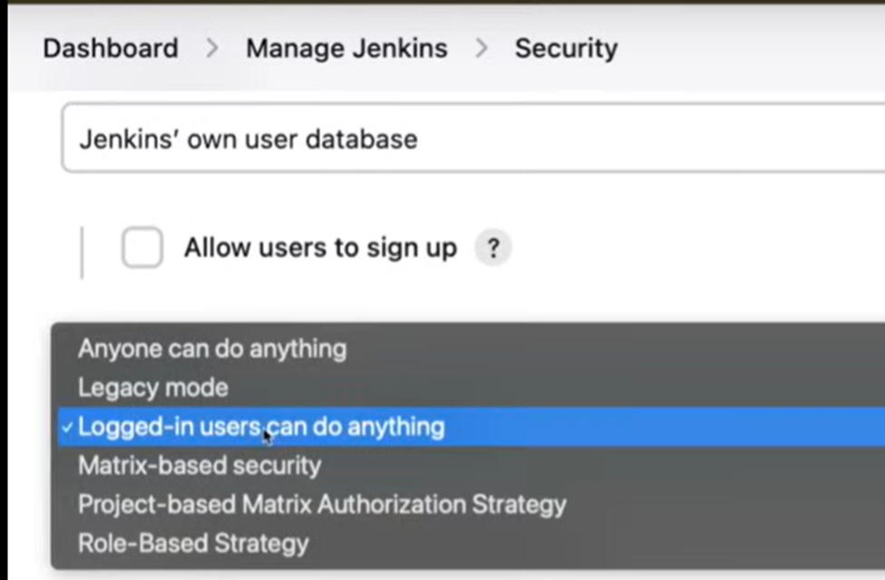
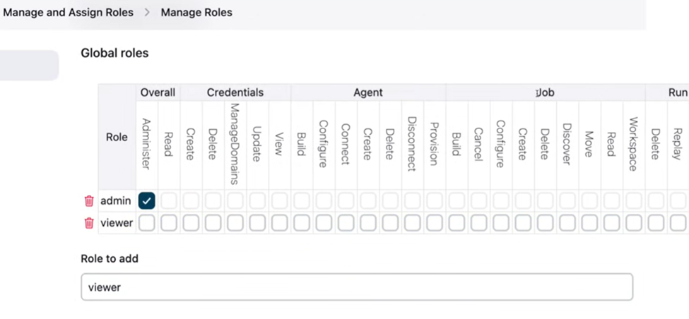

# Jenkins Administration Cheatsheet — Role-Based User Management, Tool Integrations, Workspace Cleanup, CI/CD Purpose, and Tagging

This file explains:

- **User Management with Role-Based Authorization** (step-by-step: install, configure, create roles, assign roles, project/folder scopes, best practices)
- **Integrations** (name of tool + what it does with Jenkins: SCM, build, test, security, deploy, chat, cloud, IaC)
- **Workspace Cleanup** (how/when to clean and why)
- **What CI/CD Is For** (the practical value in production)
- **Significance of “Tags”** (Git, Docker, SemVer, release flows)

---

## 1) User Management in Jenkins (Role-Based)

### A. Create Users
- Path:

    Manage Jenkins → Users → Create User

- By default (if “Anyone can do anything” auth was enabled previously) this user may inherit broad access. We will **lock it down** with role-based permissions next.

### B. Install the Role Strategy Plugin
- Log in as an **admin/root** account.
- Install plugin:

    Manage Jenkins → Plugins → Available → “Role-based Authorization Strategy” → Install and restart

### C. Switch Authorization Strategy
- Path:

    Manage Jenkins → Security → Authorization

- Choose:

    Role-Based Strategy

- Save. At this point, **nobody** has permissions until roles are created and assigned.

### D. Manage & Assign Roles (Global, Project, and Agent scopes)
- Path:

    Manage Jenkins → Manage and Assign Roles

1) **Manage Roles (define role names + permissions)**  
   - **Global roles**: e.g., `admin`, `developer`, `viewer`, `auditor`, `devops`.
     - Example minimal sets:
       
         admin: Overall/Administer (all permissions)
         developer: Job/Read, Job/Build, Job/Configure (if needed), SCM/Tag
         viewer: Job/Read, Overall/Read
         auditor: Overall/Read, Job/Read, Credentials/View (if policy allows read-only)
       
   - **Project roles**: grant permissions only for jobs whose names match a **regex** pattern.  
     - Examples:
       
         project-devs: Pattern: ^apps/alpha/.*  (permissions: Job/Read, Job/Build, Job/Configure)
         qa-only: Pattern: ^apps/.*/qa/.*       (permissions: Job/Read, Job/Build)
       
   - **Agent roles**: control access to specific nodes (rare; useful for ops teams).

2) **Assign Roles (map users/groups to roles)**  
   - **Global roles**: assign `admin` to your small admin team; `viewer` to auditors, etc.  
   - **Project roles**: assign `project-devs` to “alice”, “team-alpha”, etc.—they’ll only manage jobs matching `^apps/alpha/.*`.
   - **Agent roles**: assign if you must restrict who can run on sensitive agents.

   

   

3) **Use Groups (LDAP/AD/SAML/OIDC)**  
   - If Jenkins is integrated with an identity provider, you can assign **groups** instead of individual users. This is easier to maintain.

### E. Common Role Patterns (Production)
- **admin** (very few people)
- **viewer** (read-only for all jobs/logs, compliance)
- **dev** (read + build + configure for **their** projects only)
- **release** (extra permissions like Promote/Tag/Deploy)
- **ops** (node/agent mgmt, credentials mgmt per policy)
- **auditor** (read-only + audit logs access)

### F. Safety Tips
- Keep at least **two** admin accounts (break-glass).
- Prefer **group-based** assignment (easier rotation).
- Use **project regex** to isolate teams.
- Protect **credentials**; never give Global/Admin just to fix a single job.
- Periodically **review role mappings** and plugin updates.

---

## 2) Integrations — “Name + What It Does” With Jenkins

Below is a pragmatic catalog of tools commonly integrated into Jenkins pipelines.

### Source Control & Review
- **Git / GitHub / GitLab / Bitbucket**  
  SCM for pipelines; webhooks trigger builds; status checks on PRs; branch/multibranch pipelines.

### Build Tools & Runtimes
- **Maven / Gradle**  
  Java builds, tests, packaging; integrate with JUnit, Jacoco.
- **Node.js / npm / pnpm / yarn**  
  Frontend and Node backends; lint, unit tests, build artifacts.
- **Python (pip/poetry)**  
  App packaging, pytest, coverage.
- **.NET (dotnet CLI)**  
  Build, test, publish for C#/.NET projects.

### Containers & Registries
- **Docker / Buildx**  
  Build multi-arch images; run tests in containers.
- **Docker Hub / ECR / GCR / ACR**  
  Push/pull images, manage immutable releases.

### Testing & QA
- **JUnit / NUnit / PyTest**  
  Unit testing frameworks; Jenkins archives reports for trends.
- **Selenium / Playwright / Cypress**  
  UI/E2E testing; can run in Dockerized browsers.
- **Allure / HTML Publisher**  
  Nice test reports visualizations.

### Code Quality & Security
- **SonarQube**  
  Static analysis; quality gates to break builds on issues/coverage.
- **Checkmarx / Snyk / Trivy / Grype / OWASP ZAP**  
  SAST/DAST/Dependency/Container scanning; fail builds on critical vulns.
- **Secret Scanners (Gitleaks, truffleHog)**  
  Detect leaked secrets in code.

### Artifact & Dependency Repos
- **Nexus / Artifactory**  
  Store build artifacts, dependencies, Docker images, Helm charts.

### Orchestration & Deployment
- **Kubernetes (kubectl), Helm**  
  Apply manifests, helm upgrade; progressive delivery with health checks.
- **Docker Compose**  
  Stand up multi-service stacks in lower envs; simple prod when small.
- **Ansible**  
  Orchestrate servers and app configuration.
- **Terraform / Pulumi**  
  Provision infrastructure (AWS/Azure/GCP) as code before deploy.

### Cloud CLIs & Services
- **AWS CLI / Azure CLI / gcloud**  
  Cloud operations (ECR login, ECS deploys, S3 artifacts, secrets).
- **Vault / AWS Secrets Manager**  
  Secure secrets retrieval at build time.

### Collaboration & ITSM
- **Slack / Microsoft Teams**  
  Notify on pipeline state, releases, failures, approvals.
- **Jira / ServiceNow**  
  Create/update issues or change requests from pipeline states.

---

## 3) Workspace Cleanup — How, When, and Why

A Jenkins “workspace” is the working directory on an agent where code is checked out, artifacts are built, and caches may accumulate. Cleaning prevents disk bloat, cross-build contamination, and flaky tests.

### A. Options You Can Use
- **Clean before build** (job setting):  
  Ensures a pristine workspace each run (slower if dependencies are large).
- **`deleteDir()`** (Pipeline step):  
  Removes all files in the current workspace.
- **`cleanWs()`** (Workspace Cleanup Plugin):  
  More options (patterns, exclude/retain).
- **`ws(...)`** (Workspace step):  
  Run in a temp or isolated directory per stage.

### B. Examples

**Clean at the start of a pipeline**

    pipeline {
      agent any
      stages {
        stage('Init') {
          steps {
            deleteDir()     # or cleanWs()
            checkout scm
          }
        }
      }
    }

**Always clean at the end**

    post {
      always {
        cleanWs()          # requires “Workspace Cleanup” plugin
      }
    }

**Isolate by stage**

    stage('Build') {
      steps {
        ws('tmp/build') {
          sh "mvn -B -DskipTests package"
        }
      }
    }

### C. Practical Guidance
- For **deterministic builds**, prefer cleaning **before** checkout.
- For **speed**, keep caches (e.g., Maven `.m2`, npm cache) in a **separate** persisted path, not the job workspace.  
- Always clean **after** long-running or artifact-heavy jobs.

---

## 4) What Is the Use of a CI/CD Pipeline?

- **CI (Continuous Integration)**  
  Automatically build, test, lint, and analyze every change. Detect issues early; keep `main` always releasable.

- **CD (Continuous Delivery/Deployment)**  
  Package artifacts, push images, provision infrastructure, roll out to environments with approvals and health checks.

**Business value**:
- Faster releases, safer rollouts, consistent quality, auditability, repeatable processes, minimal manual error.

**Typical flow**:
- Dev pushes → Jenkins checks out → build/test → security scans → package → publish to registry → deploy to staging → approvals → deploy to prod → notify.

---

## 5) Significance of “Tag”

“Tag” can refer to different but related concepts; all are about **immutability and traceability**.

### A. Git Tags (Source Control)
- Immutable label on a commit (e.g., `v1.4.2`).
- Use **annotated tags** with message and signer:

    git tag -a v1.4.2 -m "Release v1.4.2"
    git push origin v1.4.2

- Jenkins can build **by tag**, publish release notes, and ensure reproducible builds.

### B. Docker Image Tags
- Identify image variants (e.g., `app:1.4.2`, `app:2025-10-01`, `app:sha-abc123`).
- **Never** rely solely on `latest` in production—use an immutable tag per release.
- Good practice: push both semantic and commit-SHA tags:

    docker build -t org/app:1.4.2 -t org/app:abc123 .
    docker push org/app:1.4.2
    docker push org/app:abc123

### C. Semantic Versioning (SemVer)
- `MAJOR.MINOR.PATCH` (`2.7.3`):  
  MAJOR for breaking changes, MINOR for features, PATCH for fixes.
- Drives automation: changelogs, compatibility gates, auto-bump pipelines.

### D. Jenkins Build Tags / Labels
- Some teams “tag” builds with metadata (build name, env, ticket) for traceability in dashboards and notifications.

**Why tags matter**:
- **Reproducibility** (rebuild exact code/image)
- **Rollback** (refer to previous known-good release)
- **Audit** (which code was deployed where, and when)

---

## 6) Quick Reference — Snippets You’ll Actually Use

**Switch to Role Strategy**

    Manage Jenkins → Security → Authorization → Role-Based Strategy → Save

**Define/Assign Roles**

    Manage Jenkins → Manage and Assign Roles → Manage Roles
    Manage Jenkins → Manage and Assign Roles → Assign Roles

**Clean Workspace (start & end)**

    pipeline {
      agent any
      stages {
        stage('Init') {
          steps {
            deleteDir()
            checkout scm
          }
        }
        stage('Build') {
          steps {
            sh "mvn -B -DskipTests package"
          }
        }
      }
      post {
        always {
          cleanWs()
        }
      }
    }

**Tag a Git release**

    git tag -a v1.0.0 -m "Release v1.0.0"
    git push origin v1.0.0

**Push Docker with immutable tags**

    docker build -t org/app:1.0.0 -t org/app:abc123 .
    docker push org/app:1.0.0
    docker push org/app:abc123

---

## 7) Common Questions & Error Fixes

- **Q: New user has too many permissions?**  
  A: You’re likely on a permissive auth strategy. Switch to **Role-Based Strategy**, define roles, then assign minimal global permissions. Use project roles for per-team access.

- **Q: “I installed Role Strategy but can’t see roles”**  
  A: After installation, go to:
  
    Manage Jenkins → Manage and Assign Roles
  
  Define roles under **Manage Roles** first, then **Assign Roles**.

- **Q: Can we integrate LDAP/AD or SSO?**  
  A: Yes. Configure **Security Realm** (LDAP/AD, SAML, OIDC). Then assign **groups** to roles.

- **Q: Jenkins job fails later because of leftover files**  
  A: Add `deleteDir()` at the beginning, `cleanWs()` in `post { always { ... } }`.

- **Q: Pipeline slow after enabling clean workspace**  
  A: Cache heavy dependencies **outside** workspace (e.g., Maven local repo, npm cache).

- **Q: Why CI/CD at all—we can deploy manually**  
  A: Manual deploys are error-prone and untracked. CI/CD ensures **repeatability**, **speed**, **quality gates**, and **traceability**.

- **Q: Why care about tags?**  
  A: Tags = **immutable references**. You can deploy, audit, and roll back reliably. They tie source to image to deploy.

---

## 8) Minimal Admin Checklist

- Authorization set to **Role-Based Strategy**.
- Admins limited; all others mapped to **least privilege** roles.
- Credentials stored in Jenkins creds, not in jobs.
- Workspaces cleaned regularly; caches handled properly.
- Pipelines produce **tagged** artifacts (Git & Docker).
- Integrations documented (who owns Sonar, Nexus, Helm repos, etc.).
- Backup Jenkins home and config; test restore.
- Keep plugins updated; review security advisories.

---
